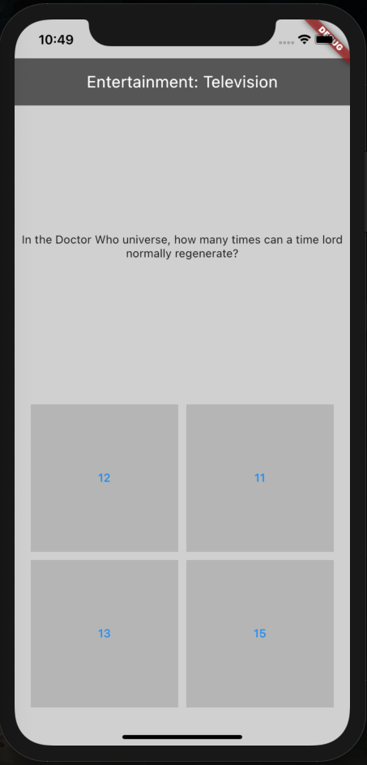

# Knowledge is power

Quiz With OpenTDB

<h3> Layout ✔ </h3>

<h3> Functionality 40% ✔ </h3>
two classes, one for question hierarchy, one for question bank ✔  
parsing json with questions and answers from api ✔ 
allow user to answer the question ✘  
save user result ✘  
restart question pool ✘  
