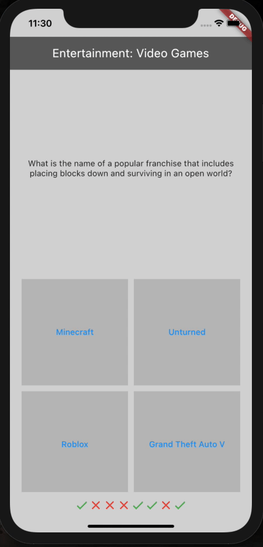

# Knowledge is power

Quiz With OpenTDB

<h3> Layout </h3>

<h3> Functionality 100% DONE!:)</h3>
two classes, one for question hierarchy, one for question bank ✔  
parsing json with questions and answers from api ✔ 
allow user to answer the question ✔  
save user result ✔  
restart button to restart question pool ✔  
randomize answers buttons ✔  

